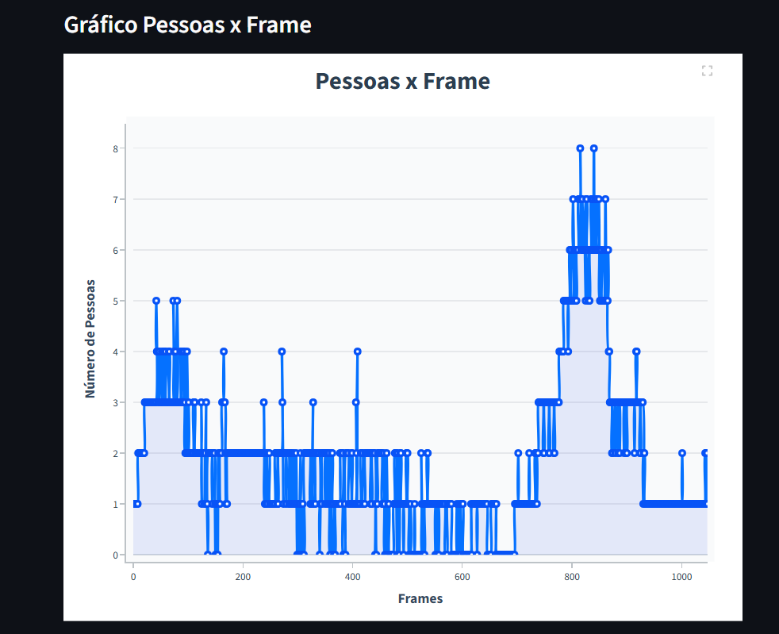
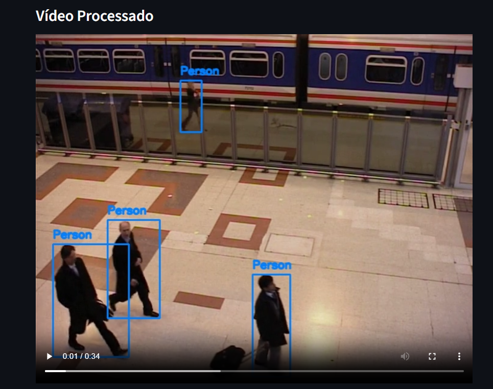

# Documentação - Detecção de Pessoas em Vídeo

## Visão Geral

Este projeto implementa um sistema completo de detecção de pessoas em vídeos utilizando técnicas de visão computacional e inteligência artificial. A solução processa vídeos frame a frame, identifica pessoas através de uma rede neural pré-treinada e gera relatórios detalhados com interface gráfica moderna.

## Arquitetura do Sistema

### Responsabilidades

**Separação de Responsabilidades:**
- `detector.py`: Responsável exclusivamente pela detecção usando YOLO
- `video_processor.py`: Gerencia processamento de vídeo e geração de outputs
- `main.py`: Orquestra o fluxo principal e argumentos
- `interface.py`: Interface de visualização

## Abordagem de Detecção de Pessoas

### Rede Neural Utilizada - YOLOv8

**Justificativa:**
- **Performance**: YOLOv8n oferece excelente balanço na velocidade/precisão
- **Pré-treinamento**: Modelo treinado no dataset COCO com 80 classes
- **Classe Person**: ID 0 no COCO dataset, otimizada para detecção humana
- **Facilidade**: Ultralytics oferece API simples e robusta

**Vantagens do YOLO:**
- Detecção em tempo real (single-shot detection)
- Bounding boxes precisas com coordenadas (x1, y1, x2, y2)
- Scores de confiança para filtrar detecções
- Suporte nativo a GPU quando disponível

### Algoritmo de Processamento

```python
# Fluxo principal implementado
for frame_id, frame in enumerate(video_frames):
    detections = detector.detect(frame)
    person_count = len(detections)
    
    # Atualização dos JSONs
    history.append({"id": frame_id, "count": person_count})
    if person_count >= threshold:
        alerts.append({"id": frame_id, "count": person_count})
    
    # Desenho das detecções
    draw_bounding_boxes(frame, detections)
    output_video.write(frame)
```

## Estrutura de Dados

### History.json
```json
[
  {"id": 0, "count": 2},
  {"id": 1, "count": 3},
  {"id": 2, "count": 1}
]
```
**Propósito**: Rastreamento completo da quantidade de pessoas em cada frame.

### Alerts.json
```json
[
  {"id": 1, "count": 3},
  {"id": 5, "count": 4}
]
```
**Propósito**: Alertas específicos quando o limiar é atingido/superado.

## Interface Gráfica

### Tecnologias Escolhidas

**Streamlit**: Framework web para prototipagem rápida
- Deploy simples e rápido
- Componentes nativos para vídeo e gráficos
- Responsivo e moderno

**Plotly**: Visualização interativa de dados
- Gráficos responsivos e customizáveis
- Hover effects e interatividade
- Exportação em diversos formatos

### Design UX/UI

**Princípios Aplicados:**
- **Simplicidade**: Interface limpa sem elementos desnecessários
- **Responsividade**: Layout adaptável a diferentes telas
- **Feedback Visual**: Cores e tipografia harmoniosas
- **Interatividade**: Hover detalhado no gráfico

**Paleta de Cores:**
- Azul primário: #0571FF
- Cinza escuro: #2C3E50
- Fundo suave: rgba(248, 249, 250, 0.8)

## Análise de Performance

### Otimizações Implementadas

**Processamento de Vídeo:**
- Codec H.264 (avc1) para máxima compatibilidade
- Preservação de FPS e resolução originais

**Detecção Neural:**
- `verbose=False` para reduzir logs desnecessários
- Filtragem apenas da classe "person" (ID 0)
- Reutilização do modelo carregado

**Interface Gráfica:**
- Cache automático do Streamlit
- Remoção de botões desnecessários no Plotly
- Carregamento lazy dos dados JSON

### Métricas de Exemplo

**Vídeo Sample (people-walking.mp4):**
- Resolução: 1920x1080
- Duração: ~30 segundos
- FPS: 25
- Pessoas detectadas: 2-8 por frame
- Tempo processamento: ~45 segundos (CPU)

## 🔧 Configurações Técnicas

### Parâmetros de Detecção

```python
# Configurações utilizadas
confidence_threshold = 0.5  # Implícito no YOLO
nms_threshold = 0.45       # Non-Maximum Suppression
input_size = 640          # YOLOv8n padrão
```

### Bounding Box Visualization

```python
# Estilo aplicado
color = (255, 128, 0)      # Azul
thickness = 2              # Espessura moderada
font = cv2.FONT_HERSHEY_SIMPLEX
font_scale = 0.6
```

## Screenshots da Aplicação

### Gráfico de Análise



### Vídeo Processado


## Conclusão

A solução desenvolvida atende integralmente aos requisitos técnicos propostos, implementando:

✅ **Processamento completo** de vídeo frame a frame
✅ **Detecção** com rede neural pré-treinada
✅ **Outputs estruturados** em JSON conforme especificação
✅ **Interface Gráfica** com boa UX/UI
✅ **Código limpo** seguindo boas práticas de OOP
✅ **Documentação completa** para instalação e uso

**Diferenciais Implementados:**
- Interface gráfica moderna e interativa
- Configurações flexíveis via argumentos
- Design responsivo
- Código bem documentado e modular

A arquitetura permite fácil manutenção, extensão e escalabilidade, demonstrando conhecimento sólido em desenvolvimento de software e visão computacional.